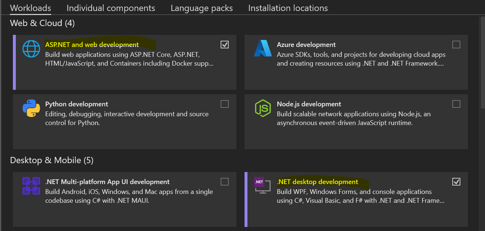

# Windows

## Build

After cloning the source code, build the solution using Visual Studio for local development, or the .NET SDK when building on a Windows server.



### Prerequisites

* Install [.NET 9.0 SDK](https://dotnet.microsoft.com/en-us/download/dotnet/9.0).

### Build

Run the following commands in the Command Prompt to build the source code using the .NET SDK.


By default the `Debug` configuration will be selected, you can also choose `Release` by providing the parameter `--configuration Release` if you want to build NexusForever in release mode.



Any warnings generated during the build process can be safely ignored.



```
cd C:/nexusforever/Source
dotnet build
```


In the Command Prompt you should see build succeeded.

<figure><figcaption></figcaption></figure>



### Prerequisites

* Install [Visual Studio 2022](https://visualstudio.microsoft.com/downloads/).\
  Ensure you install the "ASP.NET and web development" and ".NET desktop development" when installing Visual Studio.

<figure><figcaption></figcaption></figure>

### Build

* Open `C:\nexusforever\Source\NexusForever.sln` in Visual Studio.
* In the Solution Explorer, right click on the NexusForever solution and select Build Solution.


By default the `Debug` configuration will be selected, you can also choose `Release` from the configuration dropdown if you want to build NexusForever in release mode.



Any warnings generated during the build process can be safely ignored.


<figure><figcaption></figcaption></figure>

In the Output tab, under Build output you should see Build Completed.

<figure><figcaption></figcaption></figure>


